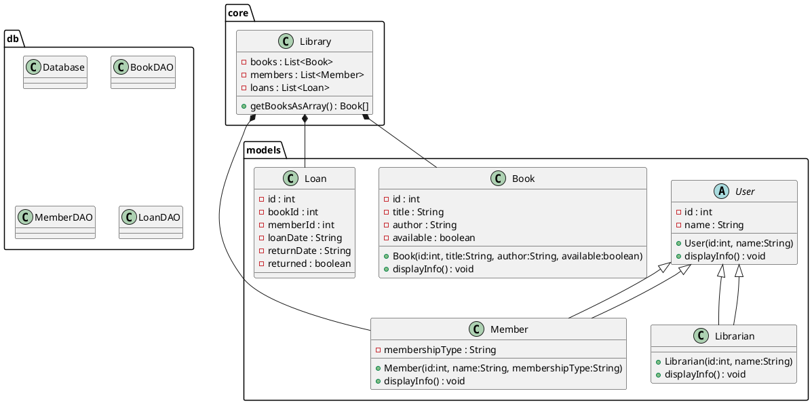

# UML (PlantUML)

```plantuml
@startuml
package "models" {
abstract class User {
  - id : int
  - name : String
  + User(id:int, name:String)
  + displayInfo() : void
}

class Member extends User {
  - membershipType : String
  + Member(id:int, name:String, membershipType:String)
  + displayInfo() : void
}

class Librarian extends User {
  + Librarian(id:int, name:String)
  + displayInfo() : void
}

class Book {
  - id : int
  - title : String
  - author : String
  - available : boolean
  + Book(id:int, title:String, author:String, available:boolean)
  + displayInfo() : void
}

class Loan {
  - id : int
  - bookId : int
  - memberId : int
  - loanDate : String
  - returnDate : String
  - returned : boolean
}

User <|-- Member
User <|-- Librarian
}

package "core" {
class Library {
  - books : List<Book>
  - members : List<Member>
  - loans : List<Loan>
  + getBooksAsArray() : Book[]
}
}

package "db" {
class Database
class BookDAO
class MemberDAO
class LoanDAO
}

Library *-- Book
Library *-- Member
Library *-- Loan
@enduml
```
